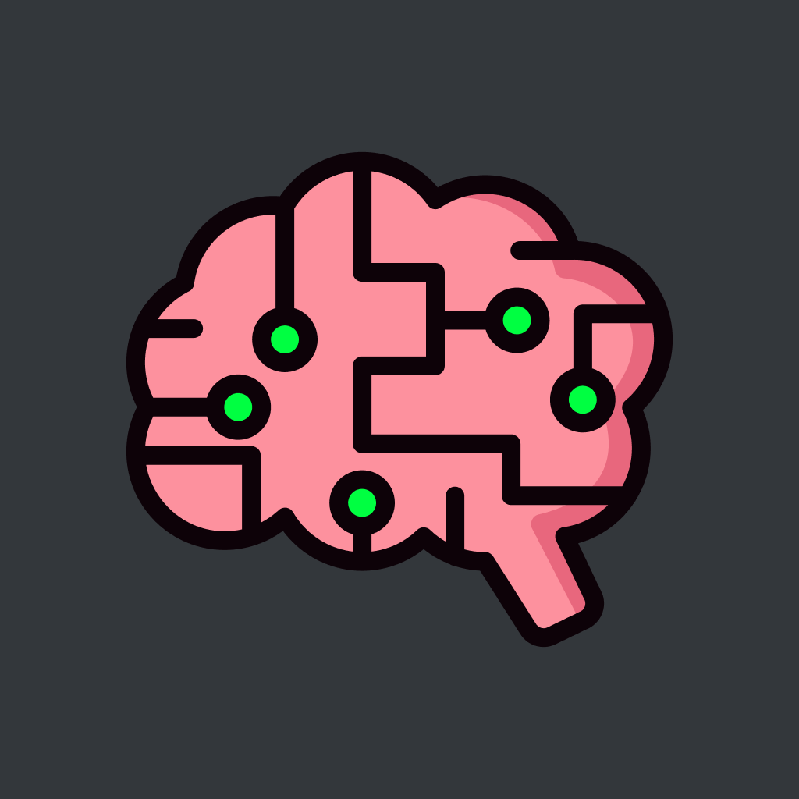
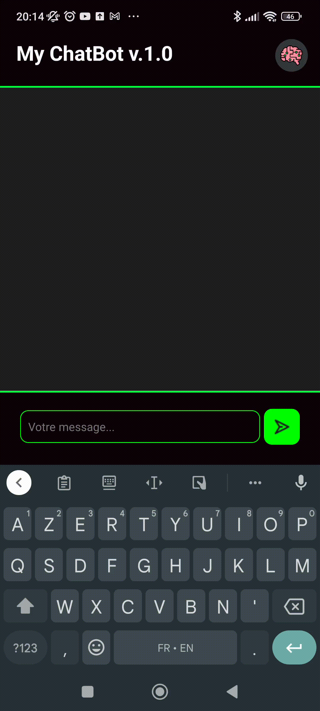

# My Chatbot

Ce projet personnel, initié en Mars 2023, est un chatbot réalisé avec le framework [**React Native**](https://reactnative.dev/), basé sur une instance GPT-3.

Le but est de pouvoir avoir un peu de pratique avec le framework, d'être en phase avec l'engouement ambiant pour l'IA, et accessoirement de mettre en place les prémices de mon "Jarvis" !

## Actuellement

Pour l'heure, le projet en est à sa version 1.0, qui consiste simplement à communiquer avec l'instance sous forme de questions-réponses, sans notion de "conversation".
## Auteur(s)

- [@Mar-Nb](https://github.com/Mar-Nb)

## Technologies utilisées

* React Native
* Expo Go

## Fonctionnalités

- Modal d'information
- Dialogue avec une IA GPT-3
- Orienté Android (pour l'instant)

## Démo

